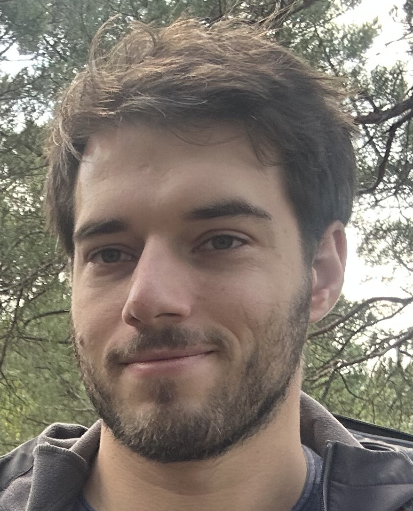

= Project Manager
Guillaume Noailhac

[.info]
== !

=== Guillaume Noailhac

[contact]
- image:phone.svg[role="picto phone"] +33 6 30 51 17 56
-  guillaume.noailhac@gmail.com
-  link:https://www.linkedin.com/in/noailhac-guillaume/[Linkedin]
- Born on September 5, 1992 (33 years old)
- Driver’s License Holder

=== !
[atouts]
* Logical thinker
* Eager to learn

==== Programming Languages
- C
- C++
- Rust
- Python

==== Developer Tools
- Git
- GitLab
- Confluence
- Yocto
- Docker

==== Certifications
- DO-178C
- Common Criteria

==== Systems
- Linux
- PikeOS
- ELinOS

==== Hardware Architectures
- ARMv8
- x86

==== Languages
- English – Professional proficiency
- French – Native speaker

[.chronologie]
== !

=== PROFESSIONAL EXPERIENCE

==== June 2024 – Present: Project Manager
===== *Provenrun* – Paris (75)

- Provided technical and organizational support during pre-sales, including client needs analysis and project scoping.
- Coordinated two technical teams (5 members), managing daily operations and aligning tasks with project goals.
- Planned workloads, tracked progress, and adapted priorities to meet evolving project requirements.
- Acted as the main client interface, delivering updates, identifying risks, and proposing mitigation strategies.

==== 2018 – 2024: Software Engineer
===== *Sysgo* – Le Pecq (78)

- Specified, developed, and validated software components including:
  - Platform Support Package (PSP)
  - Kernel drivers (Ethernet, Serial, SPI, I2C, block devices, etc.)
  - Linux kernel debugging
- Developed software certified to DO-178C DAL-C and Common Criteria EAL4+
- Created Board Support Packages (BSP) on ELinOS (DO-178C DAL-D)

==== 2017 – 2018: Software Engineer
===== *Modis* – Clermont-Ferrand (63)

- Developed and validated software for Landis+Gyr smart electricity meters
- Implemented communication protocols using object-oriented C
- Ensured reliable data exchange between meters and management systems

=== EDUCATION

==== 2016: Internship
===== *Safran Morpho* – Osny (95)

- Researched and implemented a solution for improved debug log management in C++03
- Created a Yocto recipe to enable runtime loading/unloading of a logging library
- Constraints included minimizing library size and enabling dynamic deployment on the client side

==== 2013 – 2016: Master’s Degree in Electronics and Embedded Systems Engineering
===== *ENSEA* – Cergy (95)

- Software engineering
- Parallel programming
- System-on-a-chip (FPGA, microcontroller, DSP)
- Analog and digital electronics
- Signal processing
- IT and systems

==== 2011 – 2013: Preparatory Program for MPSI/MP (Mathematics, Physics, and Engineering Sciences)
===== *Lafayette* – Clermont-Ferrand (63)

- Developed a genetic algorithm to explore solutions to the link:https://fr.wikipedia.org/wiki/Th%C3%A9or%C3%A8me_de_Stone-Weierstrass[Stone-Weierstrass theorem]

// === Interests
//
// As you can see, my primary interest is logic, which explains the progression of my CV—from mathematics to embedded programming.
